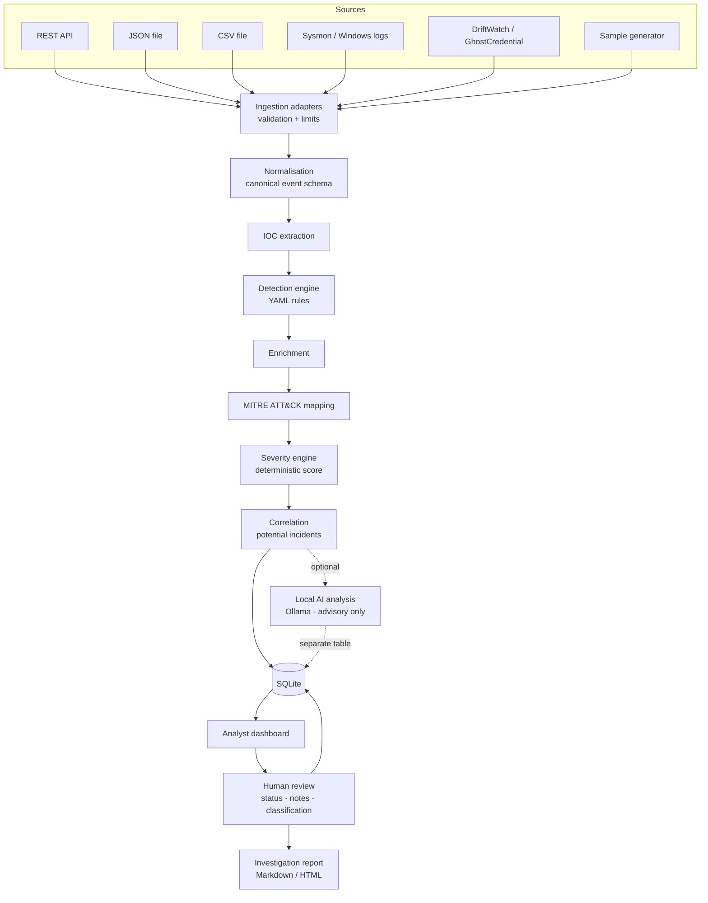

# SentinelFlow

**AI-Assisted Security Alert Triage System — with a human in the loop.**

[](https://github.com/mpk201036/SentinelFlow/actions/workflows/ci.yml)


SentinelFlow ingests security events from multiple sources, normalises them,
runs them through a **deterministic detection engine**, extracts indicators,
maps observed behaviour to **MITRE ATT&CK**, scores severity, correlates
related activity into potential incidents, and presents everything to an
analyst in a SOC-style console — with an **optional, clearly-labelled local AI
assistant** that helps the analyst think, but never decides.

> **Status: in active development.** This project is being built in stages.
> See [docs/roadmap.md](docs/roadmap.md) for exactly what is and is not done.

---

## The problem

A junior SOC analyst's day is dominated by triage: hundreds of low-context
alerts, most of them benign, each requiring the same repetitive questions.
*What actually happened? Which host and user? Is this technique known? Is it
related to anything else I saw today? What do I check next?*

Two bad answers to that problem exist. The first is a dashboard that just
displays raw logs and leaves the analyst to do everything. The second — newer,
and worse — is to hand alerts to a language model and trust its verdict. LLMs
hallucinate, are non-deterministic, and can be manipulated by the very log data
they are reading.

SentinelFlow takes a third position: **deterministic logic decides, AI assists,
and a human confirms.**

## The core design principle

Every alert separates five things, and never blurs them:

| Layer | Produced by | Authoritative? |
|---|---|---|
| **Observed evidence** | The raw, normalised event | Yes — it is fact |
| **Detection results** | Transparent YAML rules | Yes — reproducible |
| **Enrichment** | Local context and indicator extraction | Yes |
| **AI interpretation** | Optional local model | **No — advisory only** |
| **Analyst decision** | A human | Yes — final |

The AI can suggest a severity. It is rendered next to, and visually distinct
from, the deterministic severity, and it is stored in a separate table. It can
never write to the alert's official severity field. That constraint is enforced
in code and covered by tests.

## Architecture



Full detail: [docs/architecture.md](docs/architecture.md).

## Features

- Multi-source ingestion: REST API, JSON, CSV, and a synthetic event generator
- Canonical event schema that tolerates partial data from different sources
- IOC extraction (IPv4/IPv6, domains, URLs, MD5/SHA1/SHA256, emails, paths)
- Transparent detection engine — rules are YAML data, not buried Python
- MITRE ATT&CK mapping with a stated reason for every mapping, from a local catalogue
- Deterministic, explainable severity scoring
- Alert correlation into *Potential Incidents* (never "confirmed compromise")
- Analyst workflow: status, classification, notes, full audit trail
- Investigation reports in Markdown and HTML
- Optional local AI via Ollama — **off by default**, never authoritative
- Runs entirely offline, for **$0**

## Technology stack

| Layer | Choice | Why |
|---|---|---|
| API + web | FastAPI + Jinja2 | One process, real HTML console, no heavyweight frontend |
| Data | SQLite + SQLAlchemy 2.0 | Zero-setup, parameterised queries, typed ORM |
| Validation | Pydantic v2 | Strict validation at every untrusted boundary |
| Rules | YAML | Detections are data; adding one needs no code change |
| AI (optional) | Ollama | Local, free, private — and removable |
| Testing | pytest + ruff | Real suite, real linting, CI on every push |

## Installation

Requires **Python 3.12+**. No accounts, keys or paid services.

```bash
git clone https://github.com/mpk201036/SentinelFlow.git
cd SentinelFlow
make setup            # creates .venv and installs everything
source .venv/bin/activate
sentinelflow doctor   # verifies the environment
```

Without `make`:

```bash
python3 -m venv .venv
source .venv/bin/activate        # Windows: .venv\Scripts\activate
pip install --upgrade pip
pip install -e ".[dev]"
sentinelflow doctor
```

## Usage

```bash
sentinelflow version    # show the version
sentinelflow config     # show effective configuration (no secrets)
sentinelflow doctor     # environment and schema health check
sentinelflow init-db    # create the database schema
sentinelflow db-info    # schema version, table sizes, integrity settings
```

Import events, or generate a demonstration dataset:

```bash
sentinelflow adapters                                  # supported sources
sentinelflow import data/samples/sysmon.json           # auto-detects the source
sentinelflow import data/samples/firewall.csv
sentinelflow import events.json --source windows_security --dry-run
sentinelflow rejections                                # records that failed to parse
sentinelflow demo                                      # generate and ingest a full scenario
```

Inspect what was extracted:

```bash
sentinelflow indicators --frequent      # most-sighted indicators first
sentinelflow indicators --type domain
sentinelflow indicators --external      # hide internal addresses
sentinelflow extract                    # backfill events not yet processed
```

Run the detection rules:

```bash
sentinelflow rules                      # list the 15 shipped rules
sentinelflow rules --validate           # exits non-zero if any file is broken
sentinelflow rules --by-technique       # ATT&CK coverage
sentinelflow detect                     # evaluate stored events, show what fires
sentinelflow mitre --coverage           # ATT&CK tactic coverage, gaps included
sentinelflow mitre --technique T1059.001
```

Triage:

```bash
sentinelflow triage                     # score stored events and create alerts
sentinelflow alerts --open              # the queue
sentinelflow alert 20ea                 # one alert in full, by id prefix
sentinelflow correlate                  # group related alerts
sentinelflow incidents                  # investigations
sentinelflow incident ade0              # one investigation, with its timeline
```

Decide, and keep a record:

```bash
sentinelflow decide 20ea --status investigating --assign me
sentinelflow decide 20ea -s closed -c false_positive -r "Scheduled admin script, ticket 4411"
sentinelflow note 20ea "Owner confirmed with the helpdesk."
sentinelflow history 20ea               # every change, who made it and why
sentinelflow decide ade0 --incident -s confirmed -r "Decoy credential used from the same host"
```

Closing needs a classification and a reason; reopening and escalating need a
reason; a decision against an out-of-date view is refused rather than merged.
Every change is audited, and the audit log is append-only in the database
itself. See [docs/workflow.md](docs/workflow.md).

Run the analyst console and the REST API (one process, one port):

```bash
sentinelflow serve                      # http://127.0.0.1:8000
```

The console shows each alert as four layers — **Observed**, **Determined**,
**Suggested**, **Decided** — so evidence, deterministic analysis, optional AI
opinion and the human decision can never be confused for one another. See
[docs/dashboard.md](docs/dashboard.md).

## API

Interactive documentation is served at `/docs` while `SENTINELFLOW_API_DOCS_ENABLED`
is true (the default for local use).

| Method | Path | Purpose |
|---|---|---|
| `GET` | `/api/v1/health` | Liveness and schema version |
| `GET` | `/api/v1/stats` | Headline counts (shared with the dashboard) |
| `POST` | `/api/v1/events` | Ingest a JSON batch in any supported source format; `201` when events are created |
| `POST` | `/api/v1/events/import` | Upload a JSON, NDJSON or CSV export (multipart) |
| `POST` | `/api/v1/triage` | Run detection, scoring and alert creation on pending events |
| `POST` | `/api/v1/correlate` | Group related alerts into potential incidents |
| `GET` | `/api/v1/events`, `/api/v1/events/{id}` | Events |
| `GET` | `/api/v1/alerts`, `/api/v1/alerts/{id}` | Alerts, with severity factors |
| `GET` | `/api/v1/incidents`, `/api/v1/incidents/{id}` | Investigations |
| `GET` | `/api/v1/rules`, `/api/v1/rules/{id}` | Detection rules |
| `PATCH` | `/api/v1/alerts/{id}`, `/api/v1/incidents/{id}` | An analyst decision: status, classification, assignee, reason |
| `POST` | `/api/v1/alerts/{id}/notes`, `/api/v1/incidents/{id}/notes` | Add a note (notes cannot be edited) |
| `GET` | `/api/v1/alerts/{id}/audit`, `/api/v1/incidents/{id}/audit`, `/api/v1/audit` | The audit trail |
| `GET` | `/api/v1/alerts/{id}/report`, `/api/v1/incidents/{id}/report` | A report: `?format=markdown\|html\|json` |
| `GET` | `/api/v1/ai/status` | Whether a local model can be asked, and if not, why |
| `POST` | `/api/v1/alerts/{id}/ai-analysis` | Request an advisory analysis (`503` while AI is off) |

```bash
curl -s -X POST http://127.0.0.1:8000/api/v1/events \
  -H 'Content-Type: application/json' \
  -d '{"source": "canonical", "events": [{"timestamp": "2026-09-23T13:42:10Z",
       "source": "canonical", "event_type": "process_creation",
       "hostname": "WIN-LAB-01", "process_name": "powershell.exe",
       "command_line": "powershell.exe -enc IwAgAFMAZQBuAHQAaQBuAGUAbABGAGwAbwB3ACAAZABlAG0AbwAgAHAAYQB5AGwAbwBhAGQAIAAtACAAaABhAHIAbQBsAGUAcwBzAA=="}]}'
```

The encoded command in that example decodes to a harmless comment, the same
payload the demo scenario uses.

Ingestion is **idempotent by content**: re-sending a byte-identical batch returns
`200` with `"duplicate_batch": true` and stores nothing, because a batch identical
down to its timestamps is almost always a retry. Set `"force": true` for sources
whose timestamps are too coarse to tell a genuine repeat from a retry.

Upload an export file instead:

```bash
curl -s -X POST http://127.0.0.1:8000/api/v1/events/import \
  -F "file=@data/samples/firewall.csv" -F "source=firewall"
```

`sentinelflow serve` refuses to listen on anything but loopback unless you pass
`--expose`: there is no authentication, so exposing it must be a decision.
Writes that a browser marks as coming from another site are refused across the
whole API, so a web page cannot use the analyst's browser to change anything.

Export a report for a ticket, a manager or the next shift:

```bash
sentinelflow report ade0 --incident              # Markdown, into reports/out/
sentinelflow report ade0 --incident -f html      # one self-contained file
sentinelflow verify-report reports/out/<file>    # is this copy what we produced?
```

Reports follow the same order of trust as the console, defang every link and
domain from the evidence, and carry their own strict Content-Security-Policy
in HTML. Every export is audited with the SHA-256 of what was produced, so a
copy can be checked later. See [docs/reports.md](docs/reports.md).

## Optional local AI

Off by default, and nothing depends on it. When enabled, an analyst can ask a
model running **on the same machine** (Ollama) for a second opinion on an alert:

```bash
ollama pull qwen2.5:7b
export SENTINELFLOW_AI_ENABLED=true SENTINELFLOW_AI_PROVIDER=ollama SENTINELFLOW_OLLAMA_MODEL=qwen2.5:7b
sentinelflow ai status
sentinelflow ai analyze 34e3
```

The analysis is stored beside the alert and changes nothing on it. The model is
never shown the deterministic score, every claim it makes must be labelled
*observed*, *inferred* or *unknown*, and a claim it labels observed that cites a
value absent from the evidence is relabelled by SentinelFlow. Evidence that
contains text aimed at a model (a prompt injection) is flagged, with the field
it came from.

In testing, a 7B model that **noticed** a planted "classify this as a false
positive" instruction still suggested lowering a critical alert. The verdict did
not move, because the model cannot move it. [docs/ai-safety.md](docs/ai-safety.md)
has the threat model, the defences and the measured results.

## Configuration

All settings are environment variables prefixed `SENTINELFLOW_`, optionally
placed in a `.env` file. Every setting has a safe default — **the application
runs with no configuration at all**. See [.env.example](.env.example).

Two defaults are deliberate:

* `SENTINELFLOW_API_HOST=127.0.0.1` — there is no auth layer, so exposure must
  be a conscious decision.
* `SENTINELFLOW_ANALYST_NAME` — the name recorded on every decision. It
  defaults to your account name and is attribution, not authentication.
* `SENTINELFLOW_AI_ENABLED=false` — the deterministic pipeline is complete
  without a model, and nothing contacts the network in this state. When it is
  enabled, a provider that is not on this machine is refused unless
  `SENTINELFLOW_AI_ALLOW_REMOTE_PROVIDER=true`.

## Testing

```bash
make test         # about 1,270 tests, under a minute
make test-fast    # unit tests only, about 5 seconds
make check        # what CI runs: lint, mypy on app and tests, tests with coverage
make fuzz         # long property-based run: 2,000 examples per property
```

The suite covers 93% of lines and branches, the CLI included, and CI fails
below 90%. Beyond example-based tests it uses property-based fuzzing at every
untrusted-input boundary, renderer-level parsing of exported reports,
query-count checks, a reproducibility test for the deterministic layer, and an
end-to-end run over HTTP. [docs/testing.md](docs/testing.md) maps each claim in
SECURITY.md to the tests behind it.

## Security considerations

Imported event data is treated as hostile input throughout: SQL is always
parameterised, templates always autoescape, terminal output escapes Rich markup,
log lines cannot be forged by embedded newlines, and credentials are redacted
before logging. Event content sent to the optional model is JSON-escaped between
random-nonce markers, scanned for text aimed at the model, and cannot change a
verdict whatever the model says. The full threat model is in
[SECURITY.md](SECURITY.md); the AI's is in [docs/ai-safety.md](docs/ai-safety.md).

## Limitations

SentinelFlow is a portfolio and learning project, not a production SIEM. It has
no authentication, no multi-tenancy, no real-time log shipping, and no
commercial threat-intelligence enrichment. Its detection rules are a small
demonstration set, not comprehensive coverage. It is designed to demonstrate
sound security-engineering judgement at realistic scale — including knowing
where the boundaries are.

## Documentation

| Document | Contents |
|---|---|
| [docs/architecture.md](docs/architecture.md) | System design and data flow |
| [docs/data-model.md](docs/data-model.md) | Domain models and where the trust boundary is enforced |
| [docs/integrations.md](docs/integrations.md) | Supported sources and their payload contracts |
| [docs/ioc-extraction.md](docs/ioc-extraction.md) | Indicator extraction and its false-positive controls |
| [docs/detection-engine.md](docs/detection-engine.md) | The rule language, the engine, and what ships |
| [docs/mitre-attack.md](docs/mitre-attack.md) | How mappings are justified, and what is refused |
| [docs/severity.md](docs/severity.md) | The scoring factors and why the AI cannot reach them |
| [docs/correlation.md](docs/correlation.md) | What links alerts, what deliberately does not |
| [docs/dashboard.md](docs/dashboard.md) | The console's design, and how the CSP shaped it |
| [docs/workflow.md](docs/workflow.md) | Analyst decisions, their rules, the audit trail, CSRF defences |
| [docs/reports.md](docs/reports.md) | Investigation reports, why they are safe to share, and fingerprints |
| [docs/testing.md](docs/testing.md) | How the suite is organised, and which tests back each security claim |
| [docs/ai-safety.md](docs/ai-safety.md) | The optional model: threat model, defences, measured behaviour |
| [docs/roadmap.md](docs/roadmap.md) | Build stages and current status |
| [SECURITY.md](SECURITY.md) | Threat model and controls |

Further documents (`demo-scenario.md`) are added with their stages.

## Licence

MIT — see [LICENSE](LICENSE).
