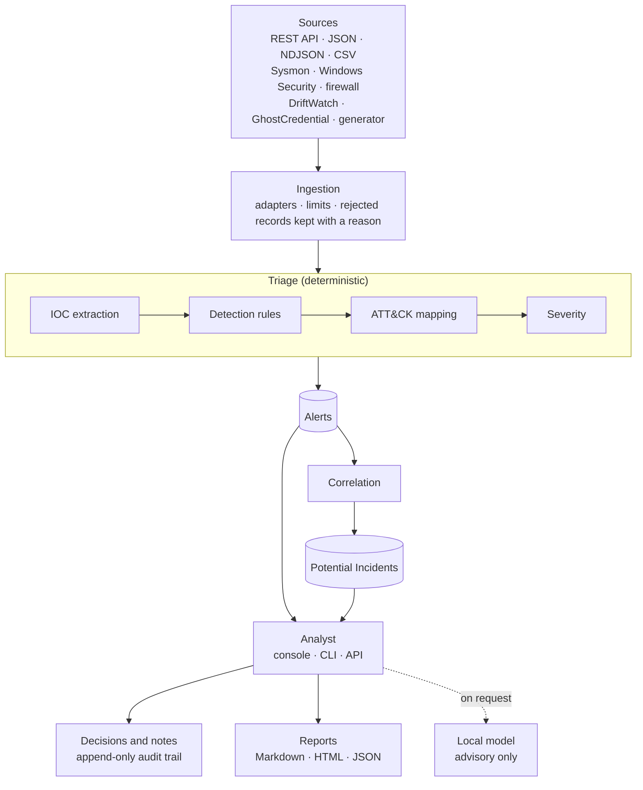

# SentinelFlow

**AI-Assisted Security Alert Triage System — with a human in the loop.**

[](https://github.com/mpk201036/SentinelFlow/actions/workflows/ci.yml)


SentinelFlow takes security events from several sources and triages them the
way a SOC analyst would. It extracts indicators, runs **deterministic detection
rules**, maps what fired to **MITRE ATT&CK** with a stated reason, scores
severity from named factors, and groups related alerts into **Potential
Incidents**. An analyst reviews all of it in a web console, a CLI or a REST API.
An **optional local AI** can be asked for a second opinion. It is clearly
labelled, and it can never change a verdict.

> **Status:** the system is complete and tested. A guided demo walkthrough and
> final repository polish are the two stages left;
> [docs/roadmap.md](docs/roadmap.md) records every stage.

## Quick start

Needs Python 3.12+ and nothing else: no accounts, no keys, no paid services.

```bash
git clone https://github.com/mpk201036/SentinelFlow.git
cd SentinelFlow
make setup && source .venv/bin/activate
sentinelflow demo       # create a database, ingest a scripted intrusion, triage and correlate it
sentinelflow serve      # then open http://127.0.0.1:8000
```

The demo ingests 56 synthetic events from four sources and produces 9 alerts
and 1 Potential Incident. Hidden among ordinary activity, and eleven minutes
long on one host, it contains:
- a burst of failed logons;
- a success from an external address;
- encoded PowerShell reaching out to the internet;
- an executable dropped in a temporary directory;
- a decoy credential being read;
- a new account added to Administrators;
- a service newly exposed to the network.

Open the investigation, then its critical alerts.

## What to look at

- **The alert page keeps four kinds of statement apart.** Observed evidence,
  deterministic analysis, the model's suggestion and the analyst's decision are
  drawn as four separate layers, so they cannot be confused.
  [docs/dashboard.md](docs/dashboard.md)
- **Every point of severity is explained.** A score is a sum of named factors,
  each with a sentence saying why it applied.
  [docs/severity.md](docs/severity.md)
- **The model cannot set a verdict, by construction.** Its severity is a
  different type from the alert's. It is never shown the deterministic score.
  A test fails if the pipeline ever imports the AI package.
  [docs/ai-safety.md](docs/ai-safety.md)
- **A prompt injection, measured.** A 7B model noticed a planted "classify this
  as a false positive" instruction and still suggested lowering a critical
  alert. The verdict held, because the model has no way to move it.
- **History the database will not let anyone rewrite.** Every decision is
  audited with who made it, when and why, and SQLite triggers refuse to edit or
  delete the audit log. [docs/workflow.md](docs/workflow.md)
- **Reports that are safe to paste into a ticket.** Hostile event text cannot
  become a link or an image. Indicators are defanged, and each export is
  fingerprinted so an edited copy is detected. [docs/reports.md](docs/reports.md)
- **Documentation that is tested.** Every command, flag, endpoint, setting,
  path, rule and ATT&CK technique these documents name is checked against the
  code on every CI run. [docs/testing.md](docs/testing.md)

## The problem

A junior SOC analyst's day is dominated by triage: hundreds of low-context
alerts, most of them benign, each requiring the same repetitive questions.
*What actually happened? Which host and user? Is this technique known? Is it
related to anything else I saw today? What do I check next?*

Two bad answers to that problem exist. The first is a dashboard that just
displays raw logs and leaves the analyst to do everything. The second — newer,
and worse — is to hand alerts to a language model and trust its verdict. LLMs
hallucinate, are non-deterministic, and can be manipulated by the very log data
they are reading.

SentinelFlow takes a third position: **deterministic logic decides, AI assists,
and a human confirms.**

## The core design principle

Every alert separates five things, and never blurs them:

| Layer | Produced by | Authoritative? |
|---|---|---|
| **Observed evidence** | The raw, normalised event | Yes — it is fact |
| **Detection results** | Transparent YAML rules | Yes — reproducible |
| **Enrichment** | Indicator extraction and local environment context | Yes — reproducible |
| **AI interpretation** | Optional local model | **No — advisory only** |
| **Analyst decision** | A human | Yes — final |

The console draws them as four layers: detection and enrichment share one,
because both are reproducible. The AI can suggest a severity. The suggestion is
shown next to the deterministic severity and styled differently, and it is
stored in a separate table. It can never be written to the alert's severity.
The code enforces this, and tests cover it.

## Architecture



Triage and correlation run when asked, never behind the analyst's back, and
the model is consulted only on an analyst's request.
[docs/architecture.md](docs/architecture.md) has the full design.

## Features

- **Ingestion** over the REST API or from JSON, NDJSON and CSV files, with
  adapters for Sysmon, Windows Security, firewall logs and the sibling projects
  DriftWatch and GhostCredential. Every refused record is kept, with the reason
- **Indicator extraction**: IPv4 and IPv6 addresses, domains, URLs, MD5, SHA-1
  and SHA-256 hashes, e-mail addresses, file paths and process names.
  Defanged input is recognised, and the stored evidence is never edited
- **15 detection rules** written as YAML data: field matches and thresholds,
  validated when loaded, never executed
- **ATT&CK mapping** from a local catalogue, with a reason for every mapping. A
  technique the catalogue does not know is refused rather than rendered
- **Deterministic severity** from additive, named factors, including local
  context: critical hosts, privileged accounts and working hours
- **Correlation** into Potential Incidents by shared host, account, address,
  process chain or indicator. An incident summary never claims a compromise;
  only an analyst can confirm one
- **Analyst workflow**: status, classification, assignee and notes, with rules
  for closing and reopening. A decision made against an out-of-date view is
  refused, not merged
- **Reports** in Markdown, HTML and JSON: escaped, defanged, fingerprinted and
  verifiable
- **Optional local AI** through Ollama. Off by default; its output is labelled,
  grounded against the evidence and checked for prompt injection
- **Runs entirely offline, for $0**

## Technology stack

| Layer | Choice | Why |
|---|---|---|
| API + web | FastAPI + Jinja2 | One process, real HTML console, no heavyweight frontend |
| Data | SQLite + SQLAlchemy 2.0 | Zero-setup, parameterised queries, typed ORM |
| Validation | Pydantic v2 | Strict validation at every untrusted boundary |
| Rules | YAML | Detections are data; adding one needs no code change |
| AI (optional) | Ollama | Local, free, private — and removable |
| CLI | Typer + Rich | Every console action is also a command |
| Testing | pytest, Hypothesis, ruff, mypy | About 1,380 tests with property-based fuzzing; lint, types and coverage enforced in CI |

## Installation

Requires **Python 3.12+**.

```bash
git clone https://github.com/mpk201036/SentinelFlow.git
cd SentinelFlow
make setup            # creates .venv and installs everything
source .venv/bin/activate
sentinelflow doctor   # verifies the environment
```

Without `make`:

```bash
python3 -m venv .venv
source .venv/bin/activate        # Windows: .venv\Scripts\activate
pip install --upgrade pip
pip install -e ".[dev]"
sentinelflow doctor
```

## Usage

Set up, and check the installation:

```bash
sentinelflow version    # show the version
sentinelflow config     # show effective configuration (no secrets)
sentinelflow doctor     # environment and schema health check
sentinelflow init-db    # create the database, or migrate an older one
sentinelflow db-info    # schema version, table sizes, integrity settings
```

`sentinelflow demo` creates the database if there is none. Every other command
that reads stored data needs `init-db` first, and says so if it has not run.

Import events, or generate a demonstration dataset:

```bash
sentinelflow adapters                                  # supported sources
sentinelflow import data/samples/sysmon.json           # auto-detects the source
sentinelflow import data/samples/firewall.csv
sentinelflow import events.json --source windows_security --dry-run
sentinelflow rejections                                # records that failed to parse
sentinelflow demo                                      # generate and ingest a full scenario
sentinelflow generate --normal 200 --seed 7            # write synthetic files to data/generated/
```

Inspect what was extracted:

```bash
sentinelflow indicators --frequent      # most-sighted indicators first
sentinelflow indicators --type domain
sentinelflow indicators --external      # hide internal addresses
sentinelflow extract                    # extract indicators without triaging
```

Work with the detection rules:

```bash
sentinelflow rules                      # list the 15 shipped rules
sentinelflow rules --validate           # exits non-zero if any file is broken
sentinelflow rules --by-technique       # ATT&CK coverage
sentinelflow detect                     # dry run over stored events: what would fire
sentinelflow mitre --coverage           # ATT&CK tactic coverage, gaps included
sentinelflow mitre --technique T1059.001
```

Triage:

```bash
sentinelflow triage                     # extract, detect, map and score new events into alerts
sentinelflow alerts --open              # the queue
sentinelflow alert 20ea                 # one alert in full, by id prefix
sentinelflow correlate                  # group related alerts
sentinelflow incidents                  # investigations
sentinelflow incident ade0              # one investigation, with its timeline
```

Decide, and keep a record:

```bash
sentinelflow decide 20ea --status investigating --assign me
sentinelflow decide 20ea -s closed -c false_positive -r "Scheduled admin script, ticket 4411"
sentinelflow note 20ea "Owner confirmed with the helpdesk."
sentinelflow history 20ea               # every change, who made it and why
sentinelflow decide ade0 --incident -s confirmed -r "Decoy credential used from the same host"
```

Closing needs a classification and a reason; reopening and escalating need a
reason; a decision against an out-of-date view is refused rather than merged.
Every change is audited, and the audit log is append-only in the database
itself. See [docs/workflow.md](docs/workflow.md).

Run the analyst console and the REST API (one process, one port):

```bash
sentinelflow serve                      # http://127.0.0.1:8000
```

The console shows each alert as four layers — **Observed**, **Determined**,
**Suggested**, **Decided** — so evidence, deterministic analysis, optional AI
opinion and the human decision can never be confused for one another. See
[docs/dashboard.md](docs/dashboard.md).

Export a report for a ticket, a manager or the next shift:

```bash
sentinelflow report ade0 --incident              # Markdown, into reports/out/
sentinelflow report ade0 --incident -f html      # one self-contained file
sentinelflow verify-report reports/out/<file>    # is this copy what we produced?
```

Reports follow the same order of trust as the console, defang every link and
domain from the evidence, and carry their own strict Content-Security-Policy
in HTML. Every export is audited with the SHA-256 of what was produced, so a
copy can be checked later. See [docs/reports.md](docs/reports.md).

## API

Interactive documentation is served at `/docs` while `SENTINELFLOW_API_DOCS_ENABLED`
is true (the default for local use).

| Method | Path | Purpose |
|---|---|---|
| `GET` | `/api/v1/health` | Liveness and schema version |
| `GET` | `/api/v1/stats` | Headline counts (shared with the dashboard) |
| `POST` | `/api/v1/events` | Ingest a JSON batch in any supported source format; `201` when events are created |
| `POST` | `/api/v1/events/import` | Upload a JSON, NDJSON or CSV export (multipart) |
| `POST` | `/api/v1/triage` | Run detection, scoring and alert creation on pending events |
| `POST` | `/api/v1/correlate` | Group related alerts into potential incidents |
| `GET` | `/api/v1/events`, `/api/v1/events/{id}` | Events |
| `GET` | `/api/v1/alerts`, `/api/v1/alerts/{id}` | Alerts, with severity factors |
| `GET` | `/api/v1/incidents`, `/api/v1/incidents/{id}` | Investigations |
| `GET` | `/api/v1/rules`, `/api/v1/rules/{id}` | Detection rules |
| `PATCH` | `/api/v1/alerts/{id}`, `/api/v1/incidents/{id}` | An analyst decision: status, classification, assignee, reason |
| `POST` | `/api/v1/alerts/{id}/notes`, `/api/v1/incidents/{id}/notes` | Add a note (notes cannot be edited) |
| `GET` | `/api/v1/alerts/{id}/audit`, `/api/v1/incidents/{id}/audit`, `/api/v1/audit` | The audit trail |
| `GET` | `/api/v1/alerts/{id}/report`, `/api/v1/incidents/{id}/report` | A report: `?format=markdown\|html\|json` |
| `GET` | `/api/v1/ai/status` | Whether a local model can be asked, and if not, why |
| `POST` | `/api/v1/alerts/{id}/ai-analysis` | Request an advisory analysis (`503` while AI is off) |

```bash
curl -s -X POST http://127.0.0.1:8000/api/v1/events \
  -H 'Content-Type: application/json' \
  -d '{"source": "canonical", "events": [{"timestamp": "2026-09-23T13:42:10Z",
       "source": "canonical", "event_type": "process_creation",
       "hostname": "WIN-LAB-01", "process_name": "powershell.exe",
       "command_line": "powershell.exe -enc IwAgAFMAZQBuAHQAaQBuAGUAbABGAGwAbwB3ACAAZABlAG0AbwAgAHAAYQB5AGwAbwBhAGQAIAAtACAAaABhAHIAbQBsAGUAcwBzAA=="}]}'
```

The encoded command in that example decodes to a harmless comment, the same
payload the demo scenario uses.

Ingestion is **idempotent by content**: re-sending a byte-identical batch returns
`200` with `"duplicate_batch": true` and stores nothing, because a batch identical
down to its timestamps is almost always a retry. Set `"force": true` for sources
whose timestamps are too coarse to tell a genuine repeat from a retry.

Upload an export file instead:

```bash
curl -s -X POST http://127.0.0.1:8000/api/v1/events/import \
  -F "file=@data/samples/firewall.csv" -F "source=firewall"
```

`sentinelflow serve` refuses to listen on anything but loopback unless you pass
`--expose`: there is no authentication, so exposing it must be a decision.
Writes that a browser marks as coming from another site are refused across the
whole API, so a web page cannot use the analyst's browser to change anything.

## Optional local AI

Off by default, and nothing depends on it. When enabled, an analyst can ask a
model running **on the same machine** (Ollama) for a second opinion on an alert:

```bash
ollama pull qwen2.5:7b
export SENTINELFLOW_AI_ENABLED=true SENTINELFLOW_AI_PROVIDER=ollama SENTINELFLOW_OLLAMA_MODEL=qwen2.5:7b
sentinelflow ai status
sentinelflow ai analyze 34e3
```

The analysis is stored beside the alert and changes nothing on it. The model is
never shown the deterministic score. Every claim it makes must be labelled
*observed*, *inferred* or *unknown*, and SentinelFlow relabels an "observed"
claim that cites a value missing from the evidence. Evidence containing text
aimed at a model (a prompt injection) is flagged, along with the field it came
from.

In testing, a 7B model **noticed** a planted "classify this as a false positive"
instruction and still suggested lowering a critical alert. The verdict did not
move, because the model cannot move it. [docs/ai-safety.md](docs/ai-safety.md)
has the threat model, the defences and the measured results.

## Configuration

All settings are environment variables prefixed `SENTINELFLOW_`, optionally
placed in a `.env` file. Every setting has a safe default — **the application
runs with no configuration at all**. See [.env.example](.env.example).

Three defaults are deliberate:

* `SENTINELFLOW_API_HOST=127.0.0.1` — there is no auth layer, so exposure must
  be a conscious decision.
* `SENTINELFLOW_ANALYST_NAME` — the name recorded on every decision. It
  defaults to your account name and is attribution, not authentication.
* `SENTINELFLOW_AI_ENABLED=false` — the deterministic pipeline is complete
  without a model, and nothing contacts the network in this state. When it is
  enabled, a provider that is not on this machine is refused unless
  `SENTINELFLOW_AI_ALLOW_REMOTE_PROVIDER=true`.

## Testing

```bash
make test         # about 1,380 tests, under a minute
make test-fast    # unit tests only, about 5 seconds
make check        # what CI runs: lint, mypy on app and tests, tests with coverage
make fuzz         # long property-based run: 2,000 examples per property
```

The suite covers 93% of lines and branches, the CLI included, and CI fails
below 90%. Beyond ordinary example tests, it uses:
- property-based fuzzing at every boundary where untrusted input arrives;
- parsing of exported reports, the way a Markdown or HTML renderer would read them;
- query-count checks;
- a reproducibility test for the deterministic layer;
- an end-to-end run over HTTP;
- tests of the documentation itself.

[docs/testing.md](docs/testing.md) maps each claim in SECURITY.md to the tests
behind it.

## Security considerations

Imported event data is treated as hostile everywhere it goes:
- SQL is always parameterised;
- templates always autoescape;
- terminal output escapes Rich markup;
- embedded newlines cannot forge log lines;
- credentials are redacted before logging.

Event content sent to the optional model is JSON-escaped between random-nonce
markers and scanned for text aimed at the model. Whatever the model says, it
cannot change a verdict. The full threat model is in [SECURITY.md](SECURITY.md);
the AI's is in [docs/ai-safety.md](docs/ai-safety.md).

## Limitations

SentinelFlow is a portfolio and learning project, not a production SIEM:
- It has no authentication and no multi-tenancy, and it is built for one
  analyst on one machine.
- It has no real-time log shipping and no commercial threat-intelligence
  enrichment.
- It stores data in SQLite, and moving to another database would take real
  work (see [docs/architecture.md](docs/architecture.md)).
- Its detection rules are a small demonstration set, not comprehensive coverage.

It is meant to show sound security-engineering judgement at a realistic scale,
including knowing where the boundaries are.

## Documentation

| Document | Contents |
|---|---|
| [docs/architecture.md](docs/architecture.md) | System design, data flow, and the reasons behind each choice |
| [docs/data-model.md](docs/data-model.md) | Domain models, where the trust boundary is enforced, tables and schema versions |
| [docs/integrations.md](docs/integrations.md) | Supported sources and their payload contracts |
| [docs/ioc-extraction.md](docs/ioc-extraction.md) | Indicator extraction and its false-positive controls |
| [docs/detection-engine.md](docs/detection-engine.md) | The rule language, the engine, and what ships |
| [docs/mitre-attack.md](docs/mitre-attack.md) | How mappings are justified, and what is refused |
| [docs/severity.md](docs/severity.md) | The scoring factors and why the AI cannot reach them |
| [docs/correlation.md](docs/correlation.md) | What links alerts, what deliberately does not |
| [docs/dashboard.md](docs/dashboard.md) | The console's design, and how the CSP shaped it |
| [docs/workflow.md](docs/workflow.md) | Analyst decisions, their rules, the audit trail, CSRF defences |
| [docs/reports.md](docs/reports.md) | Investigation reports, why they are safe to share, and fingerprints |
| [docs/testing.md](docs/testing.md) | How the suite is organised, and which tests back each security claim |
| [docs/ai-safety.md](docs/ai-safety.md) | The optional model: threat model, defences, measured behaviour |
| [docs/roadmap.md](docs/roadmap.md) | Build stages and current status |
| [SECURITY.md](SECURITY.md) | Threat model, controls, and how to report a vulnerability |

## Licence

MIT — see [LICENSE](LICENSE).
