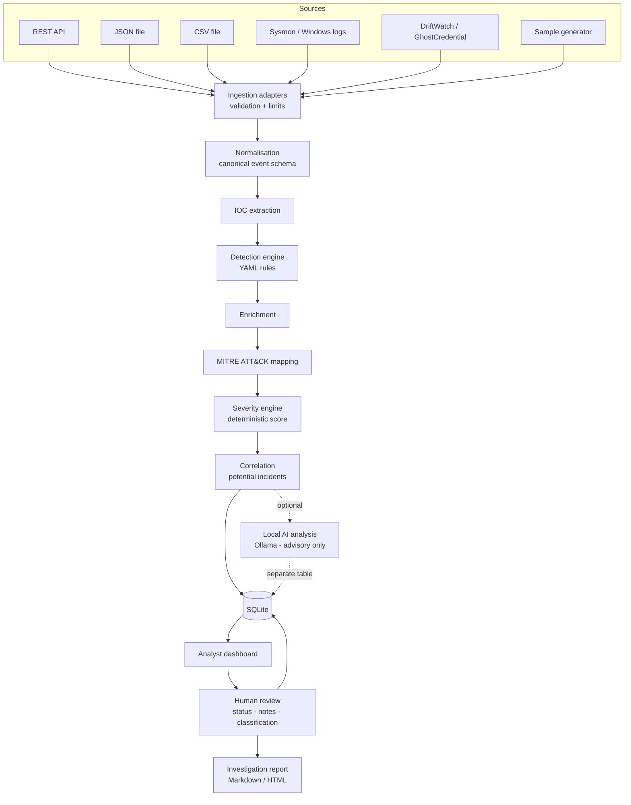

# SentinelFlow

**AI-Assisted Security Alert Triage System — with a human in the loop.**

[](https://github.com/mpk201036/SentinelFlow/actions/workflows/ci.yml)


SentinelFlow ingests security events from multiple sources, normalises them,
runs them through a **deterministic detection engine**, extracts indicators,
maps observed behaviour to **MITRE ATT&CK**, scores severity, correlates
related activity into potential incidents, and presents everything to an
analyst in a SOC-style console — with an **optional, clearly-labelled local AI
assistant** that helps the analyst think, but never decides.

> **Status: in active development.** This project is being built in stages.
> See [docs/roadmap.md](docs/roadmap.md) for exactly what is and is not done.

---

## The problem

A junior SOC analyst's day is dominated by triage: hundreds of low-context
alerts, most of them benign, each requiring the same repetitive questions.
*What actually happened? Which host and user? Is this technique known? Is it
related to anything else I saw today? What do I check next?*

Two bad answers to that problem exist. The first is a dashboard that just
displays raw logs and leaves the analyst to do everything. The second — newer,
and worse — is to hand alerts to a language model and trust its verdict. LLMs
hallucinate, are non-deterministic, and can be manipulated by the very log data
they are reading.

SentinelFlow takes a third position: **deterministic logic decides, AI assists,
and a human confirms.**

## The core design principle

Every alert separates five things, and never blurs them:

| Layer | Produced by | Authoritative? |
|---|---|---|
| **Observed evidence** | The raw, normalised event | Yes — it is fact |
| **Detection results** | Transparent YAML rules | Yes — reproducible |
| **Enrichment** | Local context and indicator extraction | Yes |
| **AI interpretation** | Optional local model | **No — advisory only** |
| **Analyst decision** | A human | Yes — final |

The AI can suggest a severity. It is rendered next to, and visually distinct
from, the deterministic severity, and it is stored in a separate table. It can
never write to the alert's official severity field. That constraint is enforced
in code and covered by tests.

## Architecture



Full detail: [docs/architecture.md](docs/architecture.md).

## Features

- Multi-source ingestion: REST API, JSON, CSV, and a synthetic event generator
- Canonical event schema that tolerates partial data from different sources
- IOC extraction (IPv4/IPv6, domains, URLs, MD5/SHA1/SHA256, emails, paths)
- Transparent detection engine — rules are YAML data, not buried Python
- MITRE ATT&CK mapping with a stated reason for every mapping, from a local catalogue
- Deterministic, explainable severity scoring
- Alert correlation into *Potential Incidents* (never "confirmed compromise")
- Analyst workflow: status, classification, notes, full audit trail
- Investigation reports in Markdown and HTML
- Optional local AI via Ollama — **off by default**, never authoritative
- Runs entirely offline, for **$0**

## Technology stack

| Layer | Choice | Why |
|---|---|---|
| API + web | FastAPI + Jinja2 | One process, real HTML console, no heavyweight frontend |
| Data | SQLite + SQLAlchemy 2.0 | Zero-setup, parameterised queries, typed ORM |
| Validation | Pydantic v2 | Strict validation at every untrusted boundary |
| Rules | YAML | Detections are data; adding one needs no code change |
| AI (optional) | Ollama | Local, free, private — and removable |
| Testing | pytest + ruff | Real suite, real linting, CI on every push |

## Installation

Requires **Python 3.12+**. No accounts, keys or paid services.

```bash
git clone https://github.com/mpk201036/SentinelFlow.git
cd SentinelFlow
make setup            # creates .venv and installs everything
source .venv/bin/activate
sentinelflow doctor   # verifies the environment
```

Without `make`:

```bash
python3 -m venv .venv
source .venv/bin/activate        # Windows: .venv\Scripts\activate
pip install --upgrade pip
pip install -e ".[dev]"
sentinelflow doctor
```

## Usage

```bash
sentinelflow version    # show the version
sentinelflow config     # show effective configuration (no secrets)
sentinelflow doctor     # environment and schema health check
sentinelflow init-db    # create the database schema
sentinelflow db-info    # schema version, table sizes, integrity settings
```

Import events, or generate a demonstration dataset:

```bash
sentinelflow adapters                                  # supported sources
sentinelflow import data/samples/sysmon.json           # auto-detects the source
sentinelflow import data/samples/firewall.csv
sentinelflow import events.json --source windows_security --dry-run
sentinelflow rejections                                # records that failed to parse
sentinelflow demo                                      # generate and ingest a full scenario
```

Inspect what was extracted:

```bash
sentinelflow indicators --frequent      # most-sighted indicators first
sentinelflow indicators --type domain
sentinelflow indicators --external      # hide internal addresses
sentinelflow extract                    # backfill events not yet processed
```

Run the detection rules:

```bash
sentinelflow rules                      # list the 15 shipped rules
sentinelflow rules --validate           # exits non-zero if any file is broken
sentinelflow rules --by-technique       # ATT&CK coverage
sentinelflow detect                     # evaluate stored events, show what fires
sentinelflow mitre --coverage           # ATT&CK tactic coverage, gaps included
sentinelflow mitre --technique T1059.001
```

Triage:

```bash
sentinelflow triage                     # score stored events and create alerts
sentinelflow alerts --open              # the queue
sentinelflow alert 20ea                 # one alert in full, by id prefix
```

Additional commands (`serve`, `report`) arrive with their corresponding stages.

## Configuration

All settings are environment variables prefixed `SENTINELFLOW_`, optionally
placed in a `.env` file. Every setting has a safe default — **the application
runs with no configuration at all**. See [.env.example](.env.example).

Two defaults are deliberate:

* `SENTINELFLOW_API_HOST=127.0.0.1` — there is no auth layer, so exposure must
  be a conscious decision.
* `SENTINELFLOW_AI_ENABLED=false` — the deterministic pipeline is complete
  without a model, and nothing contacts the network in this state.

## Testing

```bash
make test         # run the suite
make test-cov     # with coverage report
make lint         # ruff check + format check
```

## Security considerations

Imported event data is treated as hostile input throughout: SQL is always
parameterised, templates always autoescape, log lines cannot be forged by
embedded newlines, credentials are redacted before logging, and event content
sent to the optional model is delimited as untrusted evidence that cannot
override system instructions. The full threat model is in
[SECURITY.md](SECURITY.md).

## Limitations

SentinelFlow is a portfolio and learning project, not a production SIEM. It has
no authentication, no multi-tenancy, no real-time log shipping, and no
commercial threat-intelligence enrichment. Its detection rules are a small
demonstration set, not comprehensive coverage. It is designed to demonstrate
sound security-engineering judgement at realistic scale — including knowing
where the boundaries are.

## Documentation

| Document | Contents |
|---|---|
| [docs/architecture.md](docs/architecture.md) | System design and data flow |
| [docs/data-model.md](docs/data-model.md) | Domain models and where the trust boundary is enforced |
| [docs/integrations.md](docs/integrations.md) | Supported sources and their payload contracts |
| [docs/ioc-extraction.md](docs/ioc-extraction.md) | Indicator extraction and its false-positive controls |
| [docs/detection-engine.md](docs/detection-engine.md) | The rule language, the engine, and what ships |
| [docs/mitre-attack.md](docs/mitre-attack.md) | How mappings are justified, and what is refused |
| [docs/severity.md](docs/severity.md) | The scoring factors and why the AI cannot reach them |
| [docs/roadmap.md](docs/roadmap.md) | Build stages and current status |
| [SECURITY.md](SECURITY.md) | Threat model and controls |

Further documents (`detection-engine.md`, `ai-safety.md`, `testing.md`,
`demo-scenario.md`) are added with their stages.

## Licence

MIT — see [LICENSE](LICENSE).
