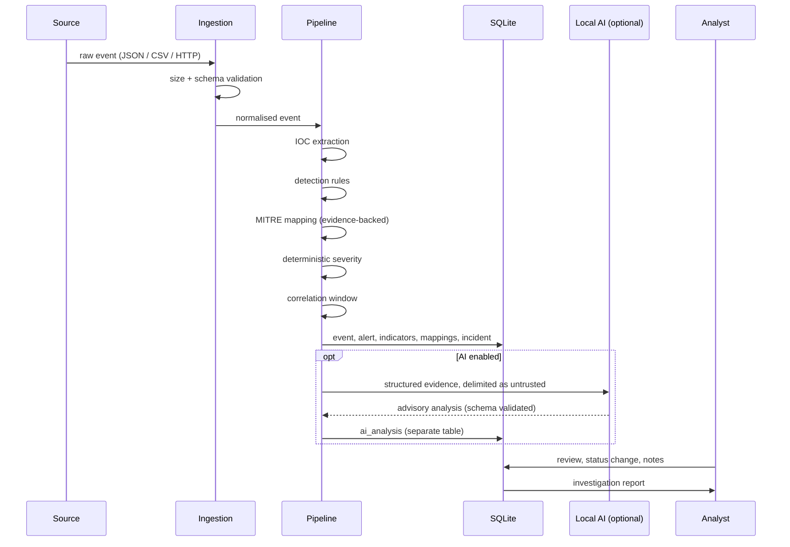

# Architecture

## 1. Guiding constraint

SentinelFlow exists to demonstrate one idea properly: **a language model can be
useful in security triage without being trusted.** Everything in the design
follows from keeping deterministic logic and probabilistic assistance strictly
separated.

Concretely:

* The deterministic pipeline is complete on its own. Disabling AI removes a
  panel from the UI and nothing else.
* AI output lives in its own table (`ai_analysis`), is rendered in its own
  labelled panel, and has no write path to `alerts.severity`.
* Every automated conclusion carries its provenance, so an analyst can always
  ask "why does it say that?" and get a real answer.

## 2. Layer responsibilities

| Layer | Package | Responsibility | Trusts input? |
|---|---|---|---|
| Ingestion | `app/ingestion` | Accept events from API/JSON/CSV/generator, enforce size and count limits, reject malformed data | No — hostile by assumption |
| Normalisation | `app/ingestion` | Map source-specific fields to the canonical event schema | No |
| IOC extraction | `app/enrichment` | Pull indicators out of event fields | No |
| Detection | `app/detection` | Evaluate YAML rules against normalised events | — |
| Enrichment | `app/enrichment` | Add local context (asset criticality, privileged account, prior sightings) | — |
| MITRE mapping | `app/mitre` | Attach ATT&CK techniques, each with a stated reason | — |
| Severity | `app/services` | Deterministic score → LOW/MEDIUM/HIGH/CRITICAL | — |
| Correlation | `app/services` | Group related alerts into potential incidents | — |
| AI (optional) | `app/ai` | Produce an advisory, labelled analysis | Explicitly quarantined |
| Persistence | `app/database`, `app/models` | Store everything with an audit trail | — |
| Presentation | `app/api`, `dashboard` | REST API + SOC console | Escapes all output |
| Reporting | `app/reports` | Markdown/HTML investigation reports | — |

## 3. Data flow

## 4. Why these technology choices

**FastAPI + Jinja2 rather than Streamlit.** A server-rendered console gives
precise control over the alert detail page — which is where the evidence /
detection / AI separation has to be visually obvious. It also keeps the whole
system in one process on one port, which makes the install story trivial.

**SQLAlchemy 2.0 with separate Pydantic schemas rather than SQLModel.** Keeping
the storage model and the API contract as distinct types prevents internal
columns leaking into responses by accident, and makes the untrusted-input
boundary explicit.

**SQLite.** Zero setup, ships with Python, and entirely adequate for a
single-analyst tool. The repository layer is written so that moving to
PostgreSQL later is a connection-string change plus a migration tool.

**YAML detection rules.** Detection content and application code have different
review cycles and different authors. Separating them is how real detection
engineering works, and it makes each rule readable by someone who does not know
Python.

**Lightweight schema versioning rather than Alembic.** For a single-file SQLite
database, a `schema_version` table with idempotent init is easier to review and
harder to get wrong. `app/database/init_db.py` is about a hundred lines and can
be read in full before trusting it; Alembic is a dependency, a config file and a
directory of generated scripts standing between `git clone` and a working
install.

The trade flips when any of these becomes true, and at that point Alembic is the
right answer rather than a bigger version of what is here:

* the database holds data someone would be upset to lose, so migrations must be
  reversible and tested against a copy of production;
* more than one person writes migrations, so merge conflicts between concurrent
  schema changes become a real problem;
* the backend moves off SQLite, where `ALTER TABLE` support stops being the
  limiting factor and autogenerated diffs start paying for themselves.

## 5. Security architecture

The controls are described in [SECURITY.md](../SECURITY.md). Architecturally,
the important points are:

1. **One validation boundary.** Nothing enters the pipeline without passing
   through a Pydantic model. Downstream code can assume shape, not content.
2. **Content stays untrusted after validation.** Valid JSON can still contain a
   prompt-injection payload or an XSS attempt in `command_line`. Escaping and
   delimiting happen at every output sink, not once at the entrance.
3. **The AI is a leaf node.** It reads from the pipeline and writes only to its
   own table. No other component reads its output to make a decision.

## 6. Extension points

SentinelFlow is built so sibling projects can feed it:

* `POST /api/events` accepts any source that can speak JSON — including
  **DriftWatch** (network exposure changes) and **GhostCredential** (decoy
  credential access).
* A source-specific adapter in `app/ingestion/adapters/` maps that source's
  fields to the canonical schema. Adding a source means adding one adapter and
  one set of tests, with no change to the pipeline.
