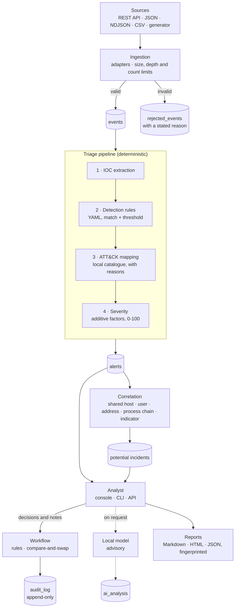

# Architecture

## 1. Guiding constraint

SentinelFlow exists to demonstrate one idea properly: **a language model can be
useful in security triage without being trusted.** Everything in the design
follows from keeping deterministic logic and probabilistic assistance strictly
separated.

Concretely:

* The deterministic pipeline is complete on its own. With AI disabled (the
  default) nothing is missing but the model's opinion, and no network request
  is made.
* AI output lives in its own tables (`ai_analysis`, `ai_statements`), is
  rendered in its own labelled layer, and has no write path to an alert.
* Every automated conclusion carries its provenance - the rule that fired, the
  factor that added points, the reason for a mapping - so an analyst can always
  ask "why does it say that?" and get a real answer.
* Only an analyst can close an alert or confirm an incident, and every such
  decision is recorded in an append-only audit trail.

## 2. How an event becomes a decision

Triage runs when asked: `sentinelflow triage`, `sentinelflow demo`, `POST
/api/v1/triage`, or an upload with `triage` on. Correlation is a separate step
(`sentinelflow correlate`, `POST /api/v1/correlate`), so an import never
regroups an investigation someone is working on without being asked to.

The model is consulted on an analyst's request, never by the pipeline, and
nothing in the pipeline imports `app.ai`; a test enforces that. See
[ai-safety.md](ai-safety.md).

## 3. Where each responsibility lives

| Responsibility | Where | Trusts its input? |
|---|---|---|
| Accept events, enforce limits, quarantine what fails | `app/ingestion` | No: hostile by assumption |
| Map each source's fields to one event schema | `app/ingestion/adapters` | No |
| Clean every string: control characters, bidi overrides, length | `app/core/sanitize.py` | No |
| Extract indicators; defang and refang | `app/enrichment` | No |
| Evaluate detection rules (`rules/*.yaml`) | `app/detection` | Rules are trusted data, loaded with `safe_load` |
| Map to ATT&CK from the local catalogue (`data/mitre`) | `app/mitre` | Unknown techniques are refused |
| Environment context (`data/context/environment.yaml`) | `app/services/context.py` | Local configuration |
| Score severity from factors | `app/services/severity.py` | - |
| Run the stages in order; build alerts | `app/services/pipeline.py`, `alerting.py` | - |
| Group related alerts | `app/services/correlation.py` | - |
| Apply analyst decisions and their rules | `app/services/workflow.py` | Every form field is attacker-controlled |
| Optional advisory analysis | `app/ai` | Model output is untrusted input |
| Reports and fingerprints | `app/reports` | Escapes everything it writes |
| Storage, schema version 6, migrations, append-only triggers | `app/database`, `app/models` | - |
| REST API, middleware, error handling | `app/api` | Refuses cross-site writes |
| Console: pages, forms, CSRF tokens | `app/web`, `dashboard/` | Autoescaped, under a strict CSP |
| Command line | `app/cli.py` | Escapes Rich markup from data |
| How an audit entry reads, everywhere | `app/core/display.py` | - |

## 4. Why these technology choices

**FastAPI + Jinja2 rather than Streamlit.** A server-rendered console gives
precise control over the alert detail page, which is where the evidence /
detection / AI separation has to be visually obvious. It keeps the whole system
in one process on one port, and it allows a Content-Security-Policy with no
inline script at all.

**SQLAlchemy 2.0 with separate Pydantic models rather than SQLModel.** Keeping
the storage model, the domain model and the API contract as distinct types
prevents internal columns leaking into responses by accident, and makes the
untrusted-input boundary explicit.

**SQLite.** Zero setup, ships with Python, and entirely adequate for a
single-analyst tool. It is not a connection-string away from PostgreSQL,
though, and saying so would be wrong: the append-only triggers are written in
SQLite's dialect, the migrations read `sqlite_master` and `PRAGMA table_info`,
the audit trail breaks ties on SQLite's `rowid`, and every connection sets
SQLite pragmas (foreign keys, WAL). Those are the places a move would touch.

**YAML detection rules.** Detection content and application code have different
review cycles and different authors. Separating them is how real detection
engineering works, and it makes each rule readable by someone who does not know
Python.

**Lightweight schema versioning rather than Alembic.** A `schema_version` table
and an ordered list of migrations in `app/database/init_db.py` - under three
hundred lines, six versions, including a table rebuild - can be read in full
before trusting it. Every migration is idempotent and tested against a
database at the version before it. The trade flips, and Alembic becomes the
right answer, when any of these becomes true:

* the database holds data someone would be upset to lose, so migrations must be
  reversible and rehearsed against a copy of production;
* more than one person writes migrations, so concurrent schema changes conflict;
* the backend moves off SQLite, where autogenerated diffs start paying for
  themselves.

## 5. Security architecture

The controls are listed in [SECURITY.md](../SECURITY.md), and the tests behind
each one in [testing.md](testing.md). Architecturally:

1. **One validation boundary.** Nothing enters the pipeline without passing
   through a Pydantic model. Downstream code can assume shape, not content.
2. **Content stays untrusted after validation.** Valid JSON can still carry a
   prompt injection or an XSS attempt in `command_line`. Escaping happens at
   every output: HTML (autoescape and CSP), the terminal (Rich markup),
   Markdown reports (escaping and defanging), the model's prompt (JSON between
   nonce markers).
3. **The AI is a leaf.** It reads stored alerts and writes only to its own
   tables and the audit log. Nothing reads its output to make a decision, and
   SentinelFlow's checks on that output are stored apart from the model's words.
4. **Decisions are the only mutable state that matters, and they are
   recorded.** An alert's status, classification and assignee change only
   through the workflow, with a compare-and-swap, and every change is appended
   to a log the database will not let anyone edit.
5. **The browser cannot be turned against the analyst.** Cross-site writes are
   refused for the whole application, and console forms carry signed tokens.

## 6. Extension points

* **A new source** is one adapter in `app/ingestion/adapters/` and its tests.
  `POST /api/v1/events` accepts any source that can speak JSON, including the
  sibling projects **DriftWatch** (network exposure changes) and
  **GhostCredential** (decoy credential access).
* **A new detection** is one YAML file in `rules/`, validated at load time. See
  [detection-engine.md](detection-engine.md).
* **A new report format** is one renderer over the `Report` model in
  `app/reports/model.py`.
* **A new model provider** implements the `ModelProvider` protocol in
  `app/ai/providers.py`, and inherits the prompt, the parser and the grounding.
