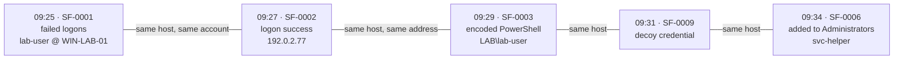

# Correlation

## The second question

An analyst's first question about an alert is *"what is wrong here?"* — the
alert itself answers that. The second is *"is this related to anything else?"*,
and that is what correlation is for.

SentinelFlow links alerts that share something concrete — a host, an account, a
network address, a process chain, an indicator — within a bounded time window,
and presents the result as a **Potential Incident**.

## Linking is transitive

Alerts are nodes; a shared signal within the window is an edge; each connected
component becomes one investigation.



If A shares a host with B and B shares an account with C, all three belong to
one investigation even though A and C have nothing directly in common. That is
how an intrusion actually looks: the chain is the story, and grouping by a
single key would cut it into unrelated fragments.

A chain can therefore span far more than one window — each *link* must be
within it, not the whole group.

## What links, and what deliberately does not

| Signal | Example | Why |
|---|---|---|
| host | `host:win-lab-01` | The most common real link |
| user | `user:lab-user` | Domain prefixes stripped, so `LAB\lab-user` and `lab-user` are one account |
| address | `address:192.0.2.77` | A password spray from one address is one investigation |
| process chain | `process_chain:cmd.exe>powershell.exe` | Repetition of an unusual parent/child pair |
| indicator | `indicator:sha256:...` | One file hash across many hosts is one investigation |

Two exclusions are deliberate.

**"Same rule" is not a link.** `SF-0003` firing on forty unrelated workstations
is forty investigations, not one incident, and merging them would bury the one
that matters. The cases people actually want from rule-based linking — a spray
from one address, one hash across many hosts — are already covered above. A
campaign view across hosts is a genuinely useful report, but it answers a
different question from *"is this alert part of that incident?"*.

**Internal addresses and process names are not indicator links.** Every
workstation runs `powershell.exe`, and every host talks to the internal DNS
server. Linking on either would merge the entire estate into one incident.

## Correlation reasons in event time

An alert created today from a week-old export describes activity from a week
ago. The window is therefore anchored on the **event's** timestamp, never on
when the alert row was written — otherwise everything imported in one afternoon
would look simultaneous, regardless of when it actually happened. There is a
test for exactly that.

## Correlation does not invent severity

An incident takes the **highest severity among its members**. It does not
compute a new number.

Adding a third scoring system at this layer would be a number nobody asked for
and nobody could explain. What correlation contributes instead is *breadth*,
recorded as stated facts:

```
Why these alerts are grouped
  - Linked by the same host (win-lab-01)
  - Linked by the same network address (10.0.0.5, 192.0.2.77)
  - Linked by the same account (lab-user, svc-helper)
  - 9 alerts spanning 11 minutes
  - 9 distinct rules matched: SF-0001, SF-0002, SF-0003, SF-0005, ...
  - Spans 7 ATT&CK tactics: Command and Control, Credential Access, ...
```

Nine independent rules across seven tactics in eleven minutes tells an analyst
far more than a number would, and it can be checked.

## The vocabulary is the claim

An incident starts as `POTENTIAL` and is rendered as **"Potential Incident"**.
The summary ends with *"This is a potential incident awaiting analyst review;
no compromise is asserted."* Only an analyst moves it to `CONFIRMED`.

There is a test asserting the summary never contains "compromised", "breach" or
"attacker" — because what a tool says it has found is a claim, and the claim has
to stay within what the evidence supports.

## Analyst work is never overwritten

Two rules protect an investigation somebody is already working on:

* **Extending an incident never touches its status or classification.** If an
  analyst has moved it to investigating, correlation finding a tenth related
  alert must not reset that.
* **An alert already in an incident is never moved to another.** When a group
  spans two existing incidents, the new alerts attach to the older one and the
  overlap is recorded as a reason — rather than silently reassigning alerts out
  of an investigation in progress.

A single alert never becomes an incident. Wrapping one alert in an incident
adds a layer and no information.

## Using it

```bash
sentinelflow correlate            # group alerts that have not been considered
sentinelflow incidents            # the investigation list
sentinelflow incident ade0        # one investigation, with its timeline
```

`sentinelflow demo` runs ingestion, triage and correlation end to end.
