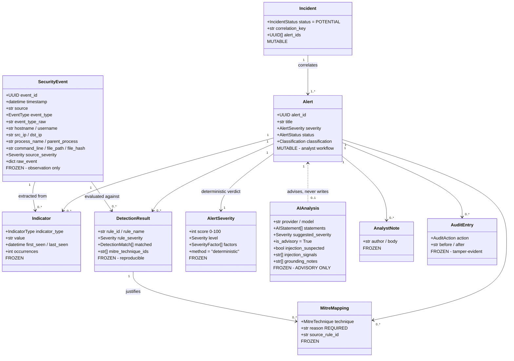

# Data Model

The domain models in `app/models/` are the vocabulary every other layer speaks.
They are plain Pydantic — no database concern leaks into them — so the shape of
the data is decided by what an analyst needs, not by what is convenient to
store.

## The shape

Note the direction of the dashed line. Every other relationship is ownership:
an alert *has* detections, indicators and mappings. `AIAnalysis` points *at* an
alert and is pointed at by nothing. It is a leaf.

## Frozen or mutable — and why

| Frozen (evidence) | Mutable (workflow) |
|---|---|
| `SecurityEvent`, `Indicator`, `DetectionResult`, `MitreMapping`, `AlertSeverity`, `AIAnalysis`, `AnalystNote`, `AuditEntry` | `Alert`, `Incident` |

Observations do not change after they are recorded. If the facts change, that
is a new record. Only the analyst's workflow state — status, classification,
assignment — is genuinely mutable, and every change to it is audited.

## Three deliberate deviations from the original field list

The project brief sketched a single flat event schema containing `severity`,
`status` and `mitre_techniques`. Those three fields were moved, and the reason
is the whole point of the project.

**1. `severity` on an event became `source_severity`.**
An event's severity field is whatever the *source* claimed — a firewall calling
everything "high", or an attacker-influenced field in a JSON payload. The
alert's severity is SentinelFlow's own verdict. If both were called `severity`,
someone would eventually read one and believe the other. The names now make the
mistake impossible to make quietly.

**2. `status` moved to `Alert`.**
Status is a fact about an investigation, not about something that happened on a
host. An event is observed once and is then unchangeable; an alert gets worked
on.

**3. `mitre_techniques` moved to `Alert`.**
ATT&CK mappings are conclusions drawn from evidence, so they live with the
other conclusions. Keeping the event free of interpretation is what makes the
"Observed Evidence" panel in the UI honest.

## Where the trust boundary is enforced

The separation between deterministic and AI-derived content is not a
convention that developers must remember. It is enforced by the types:

* `Alert.severity` is an `AlertSeverity` — a structured object carrying a
  score, a band, the factors that produced it, and a constant
  `method="deterministic"`.
* `AIAnalysis.suggested_severity` is a bare `Severity` enum.
* A bare `Severity` is not a valid `AlertSeverity`, so assigning the model's
  opinion to the alert's verdict fails validation. There is no code path that
  has to be reviewed for this; the assignment simply does not work.
* `AIAnalysis` has no field named `severity` at all, and `Alert` holds no
  reference to `AIAnalysis`.

`tests/test_ai_boundary.py` asserts each of these directly, so the guarantee
survives future refactoring.

Two voices live in an `AIAnalysis`, and they are kept apart. The model writes
the summary, the labelled statements and the lists. SentinelFlow writes
`injection_signals`, `grounding_notes` and each statement's `downgraded` flag
after the model has answered (schema version 5 gives them their own columns).
The model's text is never edited to carry SentinelFlow's findings, so an
analyst can always tell who said what. See [ai-safety.md](ai-safety.md).

## Handling untrusted values

Every string field passes through `app/core/sanitize.py` before it is stored:

* Unicode is NFC-normalised, and zero-width and bidirectional-override
  characters are removed. `cmd.exe<RLO>tab.bat` displays as something else
  entirely in a console — that is a real technique, not a hypothetical one.
* Single-line fields (hostname, process name) have newlines collapsed.
  Multi-line fields (command line, event message) keep them, because a
  multi-line PowerShell command *is* the evidence.
* Truncation is always marked with `...[truncated N chars]`, never silent.
* Values that claim to be a specific type are validated as that type. A
  malformed IP is rejected rather than stored, because a field the UI labels
  "Source IP" must contain one.

What sanitisation deliberately does **not** do: HTML-escape (Jinja2 autoescapes
at render time — doing it twice would corrupt the evidence), or strip
suspicious-looking text such as prompt-injection phrases (evidence is preserved
verbatim; neutralising injection is the AI boundary's job, by delimiting
untrusted text rather than editing it).

## History that cannot be rewritten

`AnalystNote` and `AuditEntry` are frozen in Python, and since schema version 6
the database agrees: SQLite triggers refuse any `UPDATE` or `DELETE` on
`audit_log` and any `UPDATE` on `analyst_notes`. An alert's workflow fields -
status, classification, assignee - are the only mutable part of it, and they
change only through `AnalystWorkflow`, which applies each change with a
compare-and-swap on `updated_at` and writes an audit entry for it. See
[workflow.md](workflow.md).

