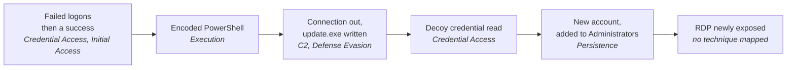

# Demo Scenario

One command stores a night's activity on a small lab network. Hidden in it is
an intrusion. This page walks through what SentinelFlow makes of that
intrusion, and then through the analyst's side of it. Every number and every
row in the tables below is checked against a real run of the demo by
`tests/test_demo_scenario.py`, so if the pipeline changes, this page fails
the build until it is corrected.

## Run it

```bash
sentinelflow demo       # creates the database if there is none
sentinelflow serve      # then open http://127.0.0.1:8000
```

The data is synthetic, and the addresses come from ranges reserved for
documentation. Background activity starts in the evening, and the intrusion
starts at 02:00 UTC on the most recent night that is entirely in the past. So
the scores are the same whenever you run it, and they match this page.
Running `demo` a second time adds nothing; `sentinelflow demo --force` adds
another copy. To start again from nothing, delete the database file, or point
`SENTINELFLOW_DATABASE_URL` at a new one.

## At a glance

| Measure | Result |
|---|---|
| Events ingested | 56 from 4 sources, 0 rejected |
| Background events that raised an alert | 0 of 40 |
| Alerts | 9: 3 critical, 4 high, 2 medium |
| ATT&CK techniques | 9 across 7 tactics |
| Potential Incidents | 1, holding all 9 alerts, spanning 11 minutes |

## What happened, and what fired

The brief this project was built from asked for five steps: authentication
failures, a successful login, PowerShell, a file download, and an
administrative account change. The scenario has all five. It adds two
signals from SentinelFlow's sibling projects: a decoy credential being read
(GhostCredential) and a newly exposed service (DriftWatch).



Each row is one alert, in event time. The first two columns are what the logs
show; the last three are SentinelFlow's deterministic conclusions.

| Time (UTC) | What the logs show | Source | Rule | ATT&CK | Severity |
|---|---|---|---|---|---|
| 02:02:00 | The fifth failed logon for `lab-user` from 192.0.2.77 in two minutes | Windows Security 4625 | SF-0001 Repeated authentication failures | T1110 | 58 medium |
| 02:04:30 | `lab-user` logs on from 192.0.2.77 | Windows Security 4624 | SF-0002 Successful logon from an external address | T1078 | 63 high |
| 02:06:30 | `cmd.exe` starts PowerShell with an encoded command and a hidden window | Sysmon 1 | SF-0003 Encoded PowerShell command | T1059.001, T1027 | 95 critical |
| 02:06:50 | That PowerShell connects to `updates.example` on port 443 | Sysmon 3 | SF-0011 Script interpreter connecting to an external web service | T1071.001 | 71 high |
| 02:07:05 | It writes `update.exe` to the user's Temp directory | Sysmon 11 | SF-0008 Executable written to or run from a temporary directory | T1036 | 55 medium |
| 02:08:05 | It reads the decoy credential `decoy-svc-backup` | GhostCredential | SF-0009 Decoy credential accessed | T1555 | 100 critical |
| 02:10:05 | `lab-user` creates the account `svc-helper` | Windows Security 4720 | SF-0005 New account created | T1136.001 | 80 high |
| 02:10:45 | `svc-helper` is added to Administrators | Windows Security 4732 | SF-0006 Account added to a privileged group | T1098 | 100 critical |
| 02:13:05 | RDP on port 3389 becomes reachable on the host | DriftWatch | SF-0010 Network service newly exposed | none, deliberately | 65 high |

The first failed logon was at 02:00:00. The rule counts five within ten
minutes, so the alert anchors on the fifth. The three failures after it do not
raise a second alert: one burst, one alert.

### The download, and what is not claimed about it

Sysmon has no "download" event. A download shows up as two events from the same
process, fifteen seconds apart: a connection out, then an executable written to
disk. That is exactly what SF-0011 and SF-0008 fired on.

SF-0004, the rule for download commands (`Invoke-WebRequest`,
`DownloadFile`), did not fire, because it reads the command line and this one
is encoded. That is why encoding is used, and why SF-0003 tells the analyst to
decode the command before concluding anything. In the demo it decodes to a
harmless comment.

SentinelFlow does not map T1105 (Ingress Tool Transfer) either. Getting there
takes an inference across two events, and a mapping here comes only from a
rule that saw the behaviour itself. The analyst can draw that conclusion,
and the tool does not draw it for them.
The same restraint applies to SF-0010: T1133 describes an adversary *using*
an exposed service, which this evidence does not show.

### How one score was reached

The alert for `svc-helper` joining Administrators scored 100:

| Factor | Points | Why |
|---|---|---|
| `rule_severity` | +65 | SF-0006 is a HIGH rule |
| `detection_confidence` | +5 | SF-0006 is high confidence |
| `privileged_account` | +15 | `svc-helper` matches the pattern `svc-*` in `data/context/environment.yaml` |
| `out_of_hours` | +5 | 02:10 UTC is outside the configured working hours |
| `repeat_activity` | +20 | Seven earlier alerts on the same host in the preceding 24 hours (the cap) |
| **Total** | **110, clamped to 100** | critical |

Every alert page and every report shows this table for its own alert. See
[severity.md](severity.md).

### Why the alerts became one investigation

Correlation linked the nine alerts because they share concrete things:
- the host `WIN-LAB-01`;
- the account `lab-user`, whether written as `LAB\lab-user` or not;
- the addresses 192.0.2.77 (the logon source, and where PowerShell connected
  to) and 10.0.0.5 (the workstation itself);
- the new account `svc-helper`.

Every link is within the correlation window. The investigation spans eleven
minutes, nine distinct rules and seven tactics. It is a **Potential Incident**:
the tool proposes the grouping, and an analyst decides what it is. See
[correlation.md](correlation.md).

## Work it as an analyst

In the console, open **Investigations**, then the one investigation. Its
timeline lists the nine alerts. Open the decoy alert: its page separates what
was **Observed**, what SentinelFlow **Determined**, the optional AI
**Suggestion**, and what an analyst **Decided**.

The same work from the command line. IDs are the first few characters of the
ones `sentinelflow incidents` and `sentinelflow alerts` print.

```bash
sentinelflow incidents
sentinelflow incident <incident-id>                 # timeline, links, techniques
sentinelflow alert <alert-id>                       # one alert, every factor
sentinelflow decide <incident-id> --incident -s investigating -a me -r "Brute force, then a decoy read on the same host"
sentinelflow note <incident-id> --incident "svc-helper was created two minutes after the decoy read."
sentinelflow decide <alert-id> -s escalated -r "Decoy read by a session that followed a brute force"
sentinelflow decide <incident-id> --incident -s confirmed -r "Failed logons, external success, encoded PowerShell, decoy read and a new admin account on one host in 11 minutes"
sentinelflow history <incident-id> --incident       # who changed what, when and why
```

Confirming the investigation does not decide its alerts for you. Each alert
keeps its own status and classification, so the record shows which of them an
analyst actually examined.

Every decision needs the reason the workflow asks for, and each one lands in
the append-only audit trail. A decision made against a view that someone else
has since changed is refused rather than merged. See [workflow.md](workflow.md).

## Report it

```bash
sentinelflow report <incident-id> --incident -f html
sentinelflow verify-report reports/out/<file>
```

The report opens with a summary of the facts and the analyst's conclusion, in
the analyst's own words, followed by:
- the timeline;
- each detection with its evidence and factors;
- the ATT&CK table, with the reason for every mapping;
- the indicators, with `updates[.]example` defanged and 192.0.2.77 labelled
  as a documentation-range address;
- the decisions, notes and audit trail.

Its SHA-256 is recorded when it is written, so `verify-report` can say later
whether a copy is the one SentinelFlow produced. See [reports.md](reports.md).

## Optional: ask a local model

With Ollama running and AI enabled (see the README), the button on an alert
page, or `sentinelflow ai analyze <alert-id>`, asks a model for a second
opinion. Its answer appears in the Suggested layer, beside a verdict it
cannot change. The model is never shown the deterministic score. If the
evidence contained text aimed at the model, the page would say so and name
the field. See [ai-safety.md](ai-safety.md).

## What SentinelFlow does not conclude

* **That the host is compromised.** It is a Potential Incident until an
  analyst confirms it, and the incident summary never claims more.
* **That 192.0.2.77 is malicious.** An indicator is a fact about a string in
  the evidence. The report labels this one as a documentation-range address,
  which is what it is.
* **Techniques it did not observe.** T1105 and T1133 would each read well
  here, and neither is supported by what a rule saw.
* **What the analyst should decide.** The rules recommend next steps, the
  model (if asked) offers an opinion, and the analyst decides.
