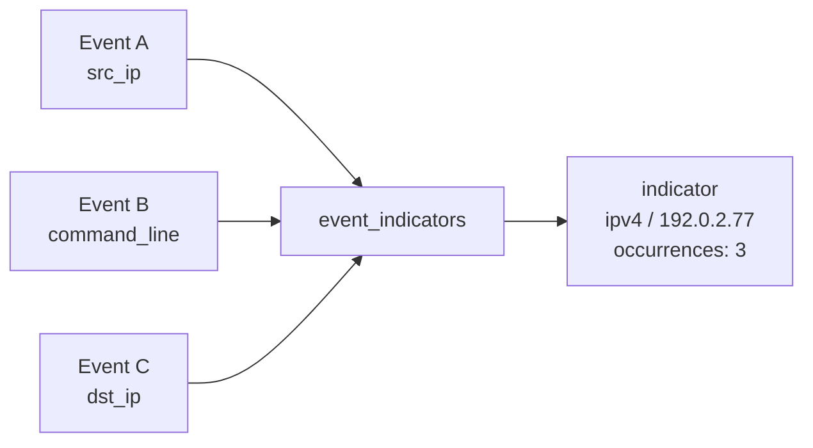

# IOC Extraction

## What an indicator is here

**An indicator is a fact about a string that appeared in an event.** Nothing
more.

`8.8.8.8` in a DNS query is an indicator. It is not malicious. SentinelFlow's
`Indicator` model has no `malicious`, `threat_level`, `score` or `verdict`
field, and a test asserts that it never gains one. Deciding what an indicator
means is the detection engine's job; deciding what to do about it is the
analyst's.

That restraint is the point. A tool that labels every extracted string
"suspicious" teaches its users to ignore the indicator panel.

## Extraction runs in two passes

**Structured fields first.** `src_ip` is an IP address because the schema
validated it as one on the way in. Re-deriving that with a regex would be
slower, less reliable, and would lose the field name — and the field name is
the context that makes an indicator readable. "Seen in `dst_ip`" says
considerably more than "seen".

**Free text second.** `command_line` and `event_message` are where the
interesting indicators hide: a URL passed to a downloader, an address in an
error message, a hash in a log line. This is also where every false positive
comes from.

## Not matching things is most of the work

A naive IPv4 regex finds version numbers. A naive domain regex finds every
filename. A naive hash regex finds any run of hex. Each pattern in
`app/enrichment/patterns.py` is therefore paired with a rejection rule:

| Pattern | The failure it avoids | The rule |
|---|---|---|
| IPv4 | `10.0.19041.1234` is a Windows build number, not four octets | Lookarounds reject a match embedded in a longer dotted-numeric run, then `ipaddress` parses it |
| IPv6 | `13:42:10` is a timestamp; `00:1a:2b:3c:4d:5e` is a MAC | The pattern is permissive on purpose and `ipaddress` is the real test |
| Domain | `update.exe`, `config.json`, `script.ps1` all look like domains | The final label must be in a curated TLD allow-list |
| Hash | A 100-character hex blob contains no digest | Exactly 32, 40 or 64 hex characters with no hex either side |
| POSIX path | `total = 10/20/30` is arithmetic | Must begin with a real system directory (`/etc`, `/tmp`, `/var`, …) |

### Two deliberate trade-offs in the TLD list

**`.zip` and `.mov` are excluded.** Both are real TLDs. Both are far more often
file extensions in a security log. Treating `payload.zip` as a domain would be
wrong more often than right, and a missed indicator is recoverable where a
wrong one erodes trust in the whole panel.

**RFC 2606 names are included** — `example`, `test`, `invalid`, `localhost`.
Synthetic data, lab environments and documentation legitimately use them, and
SentinelFlow's own sample data would otherwise extract nothing.

## Defanged indicators

Threat reports and ticketing systems defang indicators so they cannot be
clicked: `hxxp://evil[.]example`, `192.0.2[.]77`, `user[at]example.com`. Those
strings arrive in pasted evidence and imported alerts.

Refanging happens on a **copy** used only for extraction. The stored event keeps
exactly what arrived. Editing evidence to make a regex happy would be a
straightforward way to mislead an analyst, so it does not happen — the defanged
original stays in `raw_event`, and only the *indicator* is canonical. There is a
test for precisely this.

## Internal, external, and documentation ranges

`Indicator.is_internal` deliberately does **not** use Python's
`ipaddress.is_private`. That property is true for the RFC 5737 documentation
ranges (`192.0.2.0/24`, `198.51.100.0/24`, `203.0.113.0/24`), because they are
not globally routable.

Those ranges are exactly what synthetic data and public write-ups use to
represent an *external attacker* — including SentinelFlow's own demo scenario.
Labelling the attacker's address "internal" in the UI would be actively
misleading, so `is_internal` checks the private, loopback and link-local
networks explicitly, and `is_documentation` reports the reserved ranges
separately.

Seeing a documentation address in data that is supposed to be real is itself
worth noticing: it usually means test data leaked into a production feed.

## Storage shape

One indicator per `(type, value)`, linked to every event it appeared in.



Seeing `192.0.2.77` in fifty events is **one** indicator with fifty sightings,
not fifty indicators. The link table is what lets an analyst ask "show me
everything that mentioned this address" — including the events where it only
appeared inside a command line, which no column query can reach.

Sightings are timestamped with the **event's** time, not the time extraction
ran. An indicator first seen in a log from three days ago was first seen three
days ago.

## Bounds

A crafted command line should cost one noisy alert, not ten thousand database
rows. Extraction caps at 200 indicators per event and records
`truncated=True` when it hits the limit, so the shortfall is visible rather
than silent.

## Using it

Extraction is the first step of triage, so it runs whenever events are
triaged: `sentinelflow triage`, `sentinelflow demo`, or an upload to the API
with `triage` left on. `sentinelflow import` only stores events.

```bash
sentinelflow import events.json            # store only
sentinelflow triage                        # extract indicators, detect, score
sentinelflow extract                       # extract without triaging

sentinelflow indicators --frequent         # most-sighted first
sentinelflow indicators --type domain
sentinelflow indicators --external         # hide internal addresses
```
